# Data is the new Currency

## Challenge 1

This is a pcap forensics challenge, and the intructions give the following hint about what to look for:

```
> What file is sent to the customer, who just purchased access to the voter information service? (Answer Format is the full path)
```

So let's look at the PCAP:

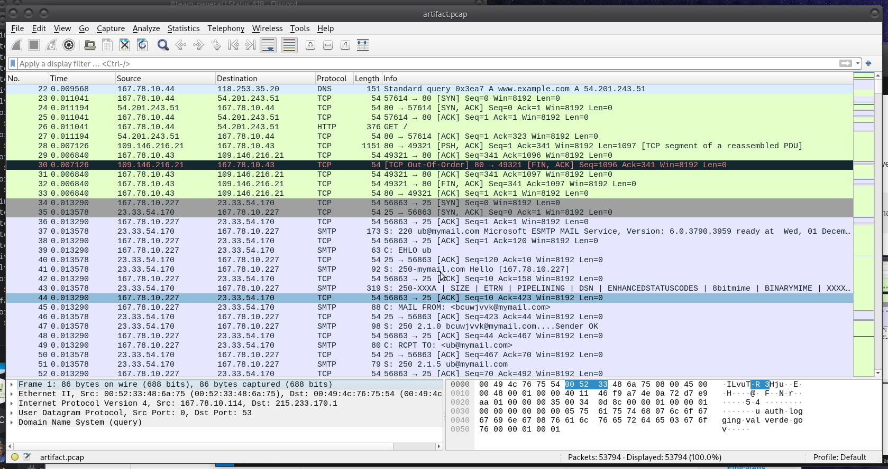

Initally, we can see some HTTP traffic and unencrypted SMTP traffic. Usually, looking at HTTP traffic is a good place to start, and there are some interesting things in the HTTP streams that we will look at later (mixed with a lot of junk), but first let's check out the emails.

To do this, we will apply a quick filter: `smtp`

From here we can see all the unencrypted emails and go through them. There's a much more readable way to view them however, if we right click on an email and choose `Follow > TCP Stream ` we can get a view of an entire conversation.

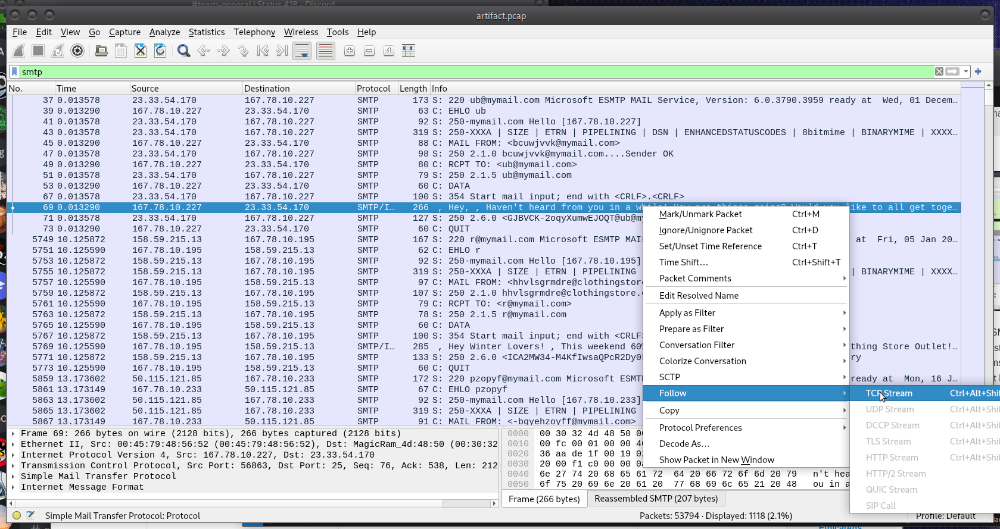

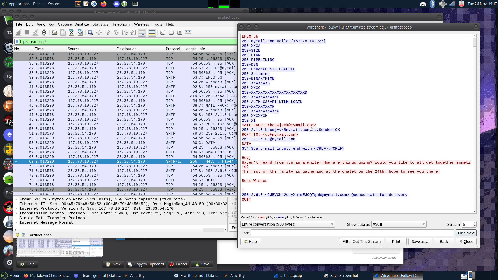

OK, looks like this email has nothing interesting. Most of them have nothing interesting. While solving this challenge I definitely looked at a lot of irrelevant things, and a couple red herrings (flag.zip with a jpeg of... a flag!). Let's see if we can refine our search with info from the problem description. They mention a voter information service, so let's apply the filter:

```
smtp contains "service"
```

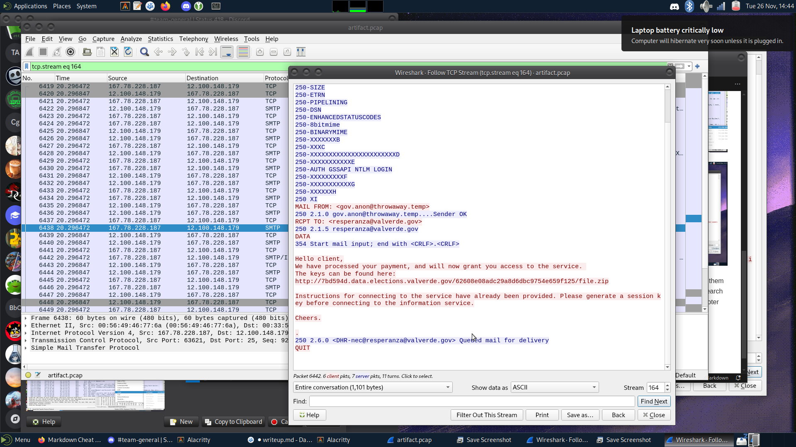

Bingo. 

This was enough to get the first flag, but just for completion's sake we can also look for where the client actually downloaded this file. It will be useful in the next part, anyway. Let's apply filter `tcp contains "file.zip"` and then `Follow > TCP Stream`

Here we can see the HTTP get request where the client downloads the ZIP archive.
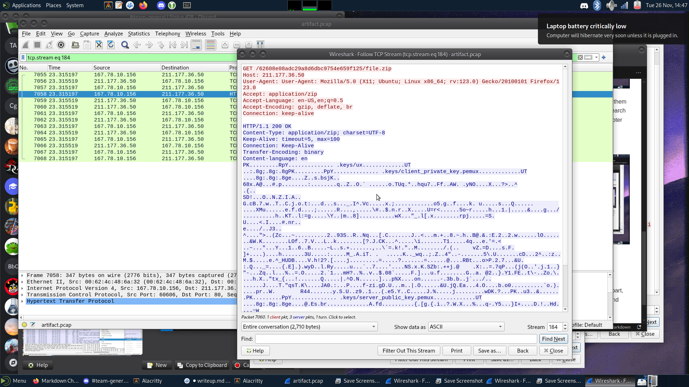

This is all that was needed for the first part of the challenge. For the next part, let's work on downloading the contents of this zip file.

## Challenge 2

The instructions for this part of the challenge say:

```
> Hint: The 2 types of crypto used are AES CBC and RSA
> What is the occupation of Tatiana Castro?
```

I can see in the data of the HTTP packet that the ZIP archive contains a client_private_key and a server_public_key. This sounds relevant to the hint that indicates RSA is used, so let's get into this file.

### Step 1 - Extracting file.zip

Usually the easiest way to download files from a pcap is using `File > Export Objects`, so that was the first thing I tried.

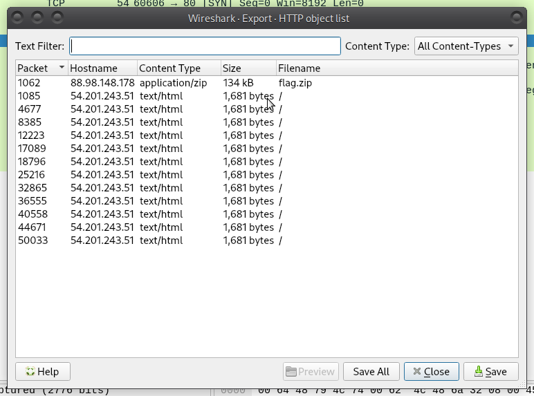

Weird, it looks like Wireshark is not detecting file.zip, only flag.zip. I downloaded flag.zip and found a JPEG of the flag of Val Verde (the fictional country that was relevant to the event theme), and tried all the steganography tools in my arsenal, but to no avail. It was a big waste of time.

This was about as far as I got during the actual competition. There were a few other HTTP requests that distracted me, such as a `/directory` page with a full list of all employees and their professions. Unfortunately there was no Tatiana, and I ran out of time before getting any further.

After the competition, I spoke to a friend on another team who got a little further than I did, and she encouraged me to try harder to export file.zip, and here's how I got there:

If we go back to the HTTP request where the file was downloaded, we can see the full contents of the ZIP archive were transmitted. I know from googling that the header for a ZIP file is `PK` or, in hex, `50 4b`. I can see PK in the HTTP packet. So I was thinking, if I can take the hex values of this tranmission and shove it into a file, I should be able to open it.

In Wireshark, change the view mode to "RAW" to show the packet as hex and save the packet as a .zip.

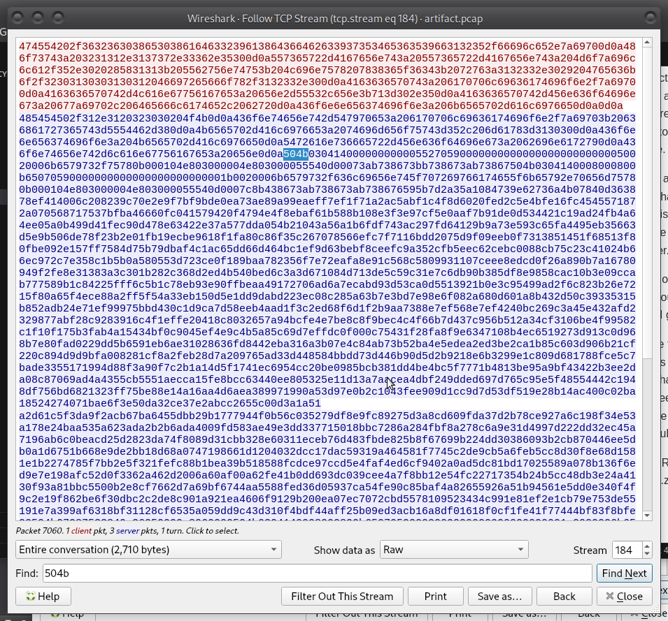

Now let's open this in a hex editor, GHex.

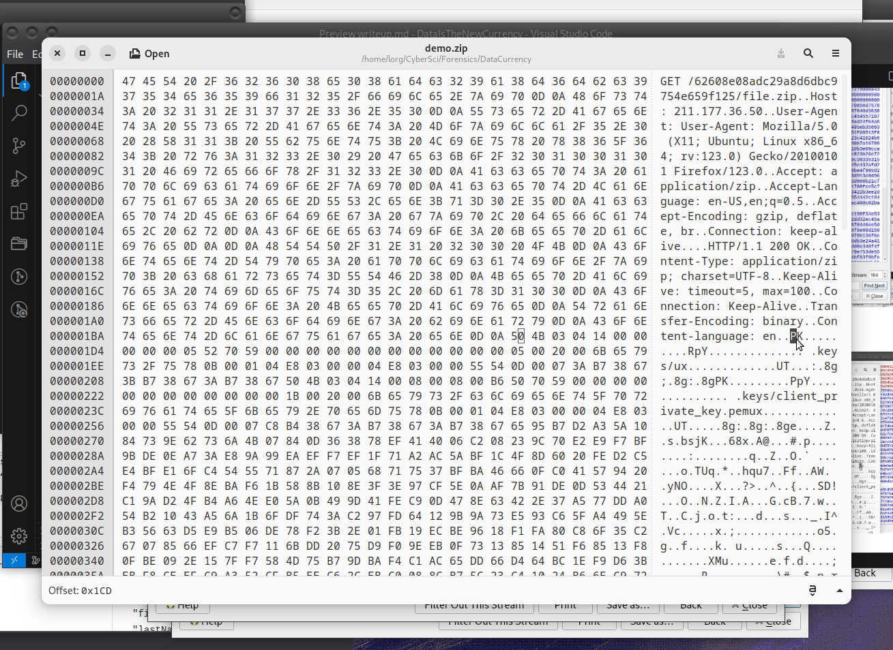

Then simply delete everything before the ZIP header and unzip the file.

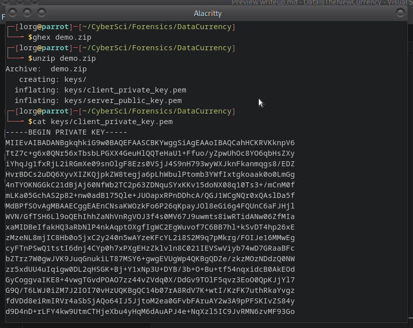

Cool. An RSA key. What do we do with it?

### Step 2 - Getting the AES Key

This next part is where the problem starts to get a little guessy. My first instinct was to use this key to decrypt some of the traffic. Usually you can do this by going to `Edit > Preferences > TLS > RSA Keys` and adding the key. But there is really no TLS traffic to decrypt here, so what do we do with this key?

After combing through the pcap for way too long looking for anything fishy and not finding much, I went back to the packet where `file.zip` was downloaded. I decided to filter based on the IPs involved in this exchange, to see if that led anywhere.
Let's see what the user did after downloading the keys in the file. The ip of that user is `167.78.10.156`, so let's apply that as a filter in Wireshark:

```
ip.addr eq 167.78.10.156
```

After doing this, there were indeed two conversations in the TCP traffic that could be interesting:

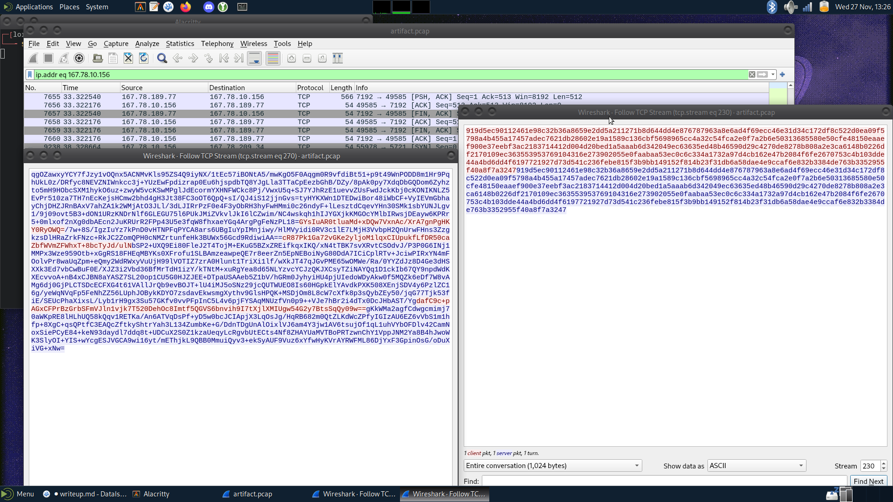

One of these looks like a big hex string, and one of them kind of looks like base64. Maybe we can do something with this??? Time to CyberChef.

Couldn't get very far with the stuff on the left, but here's what worked for the hex string on the right:

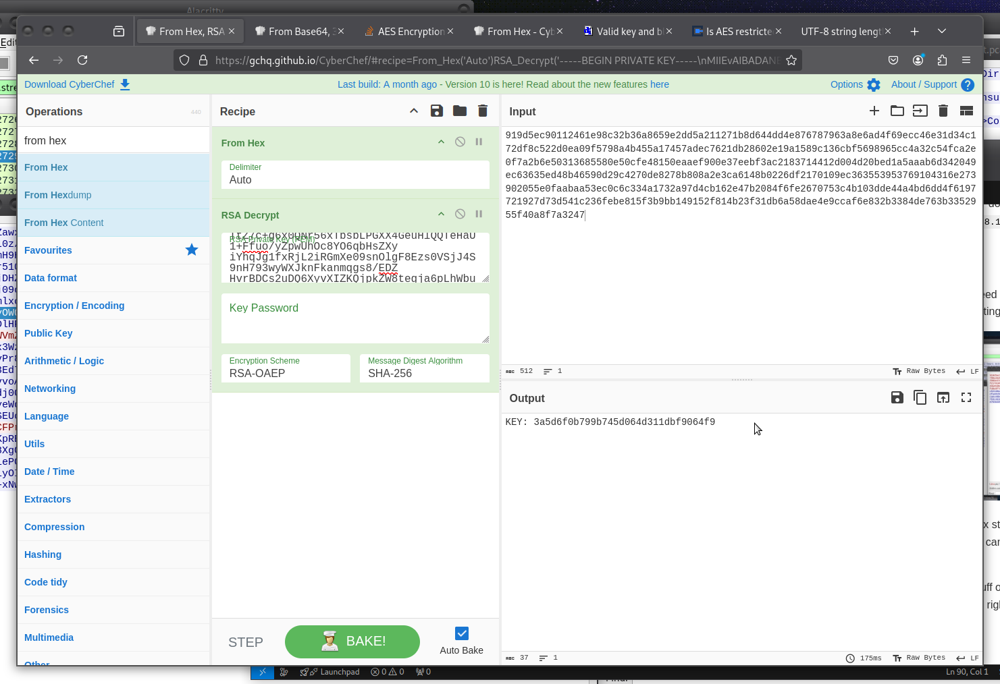

Hell ya. Since the description said AES CBC was used, this must be the AES key.

### Step 3 - Getting the IV

This is, as far as I know, as far as anyone got on this challenge. From here we can try decrypting the base64 traffic from the other conversation, using the key we just found. The problem is, we don't have the IV. I thought that maybe the hex string that was visible in the file path for the first flag might be it, but no luck. I've tried a few other things but I haven't come across any promising leads.

So this is where we are stuck for now, until the challenge author releases the writeup.

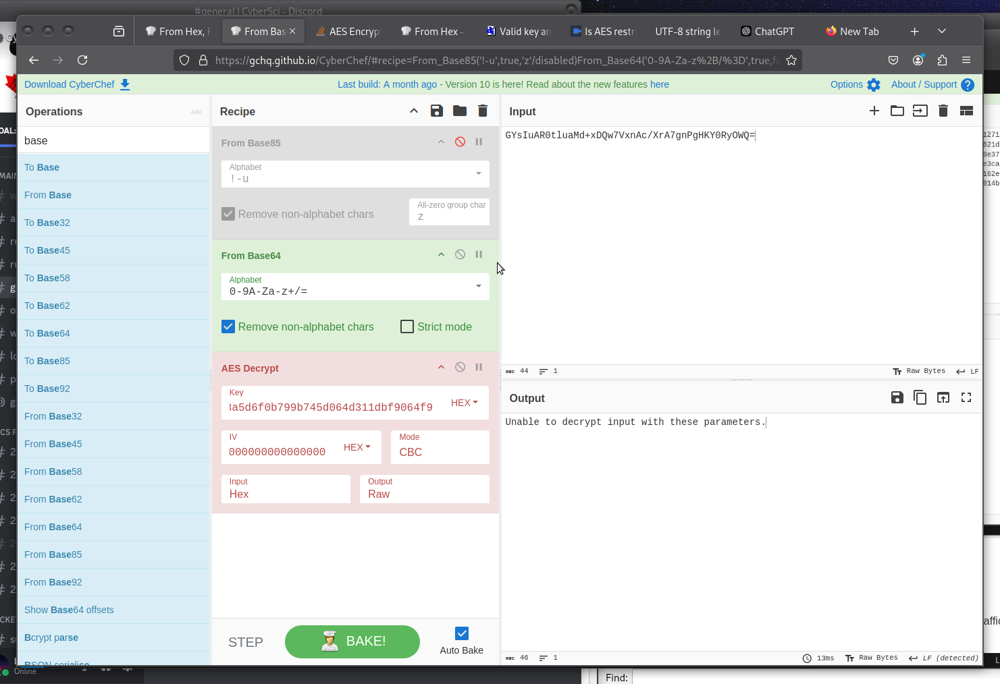

Even though this is not the most satisfying ending, I hope this writeup was useful for showing you some of the steps that typically go into solving pcap challenges. Wireshark is great B-)

I will update this with the last few steps when they are released, just for completion's sake even though I couldn't get there myself.