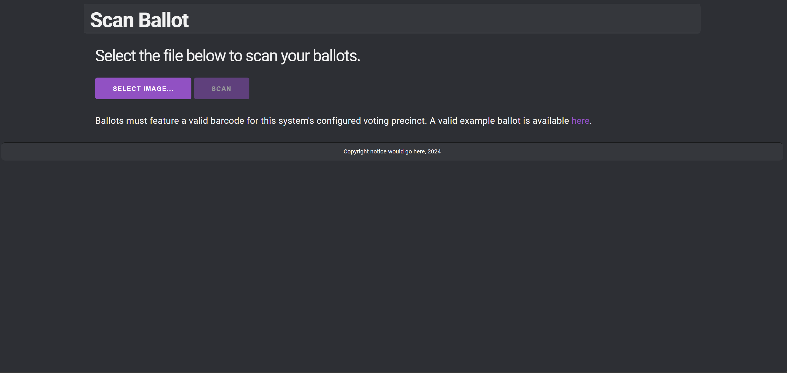
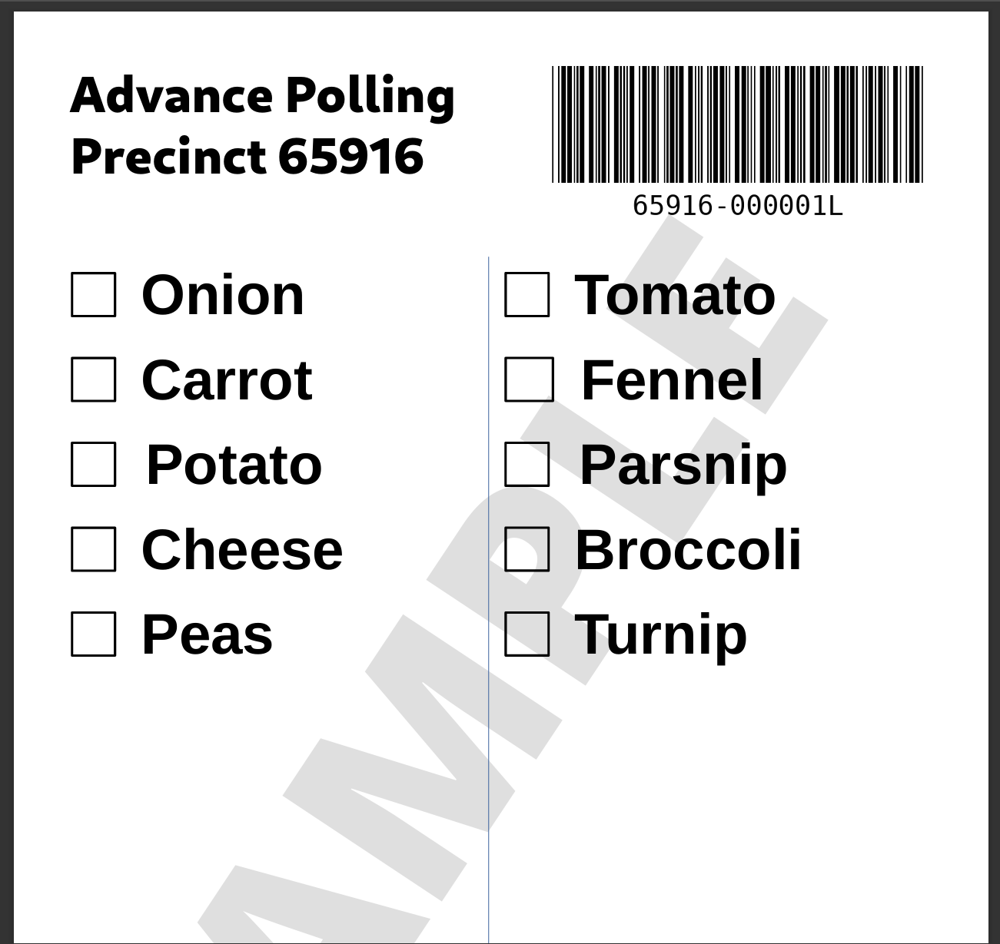
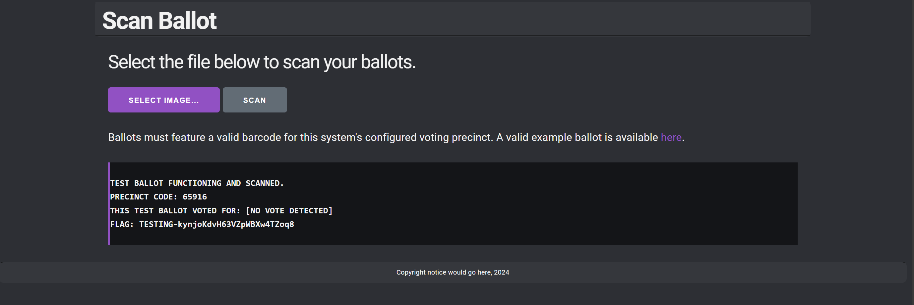
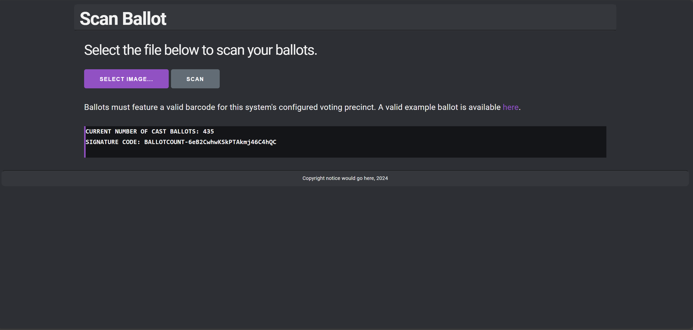
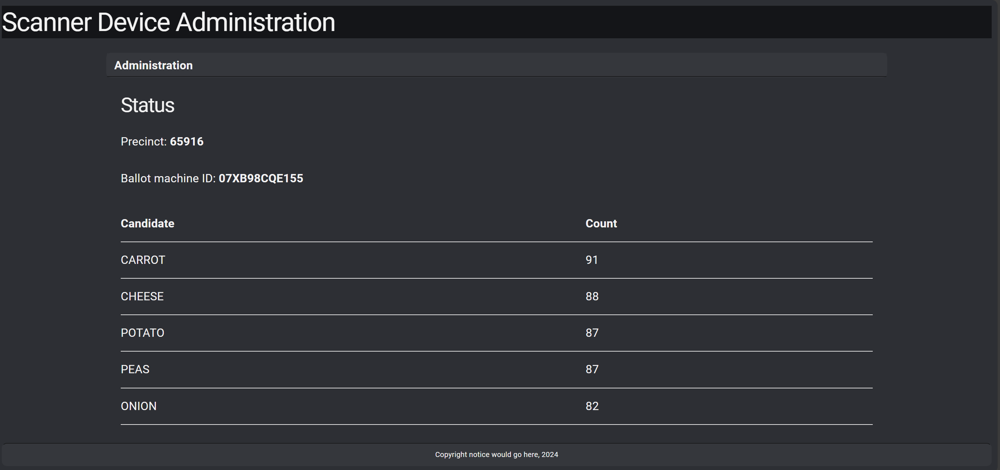

# Ballot Scanner

## Flag 1
The ballot scanner web-page was a single-page application which allows a user to upload a voting ballot. 

The web-page also links to the `ballot_sample.pdf` which demonstrates what the website expects. 

Naturally my first test was to simply upload the pdf however the web-page only accepts an image input so I simply screenshotted the PDF and uploaded the screenshot giving me the first flag.

## Flag 2
This flag took me a very long time to figure out because I was overcomplicating it. I'd assumed it was some-sort of injection using the barcode. It was not. Instead it was simply a matter of sending a ballot with a barcode value incremented by 1, or `65916-000002`. I used [this](assets/barcode_gen.py) code to generate the barcode document image.

## Flag 3
I did not manage to get this flag during the competition however after deciding to keep things simple I tried bruteforcing different acceptable barcode values. When given ballot with the barcode `65916-000099` the following admin page was provided where the machine id is flag.

